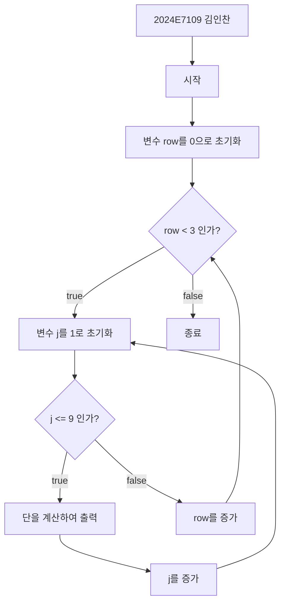
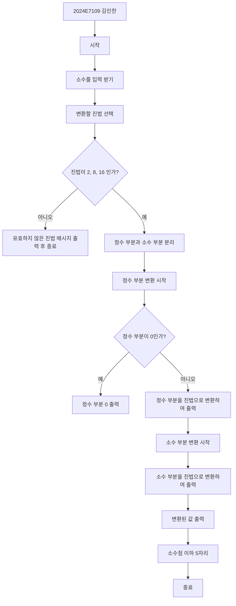
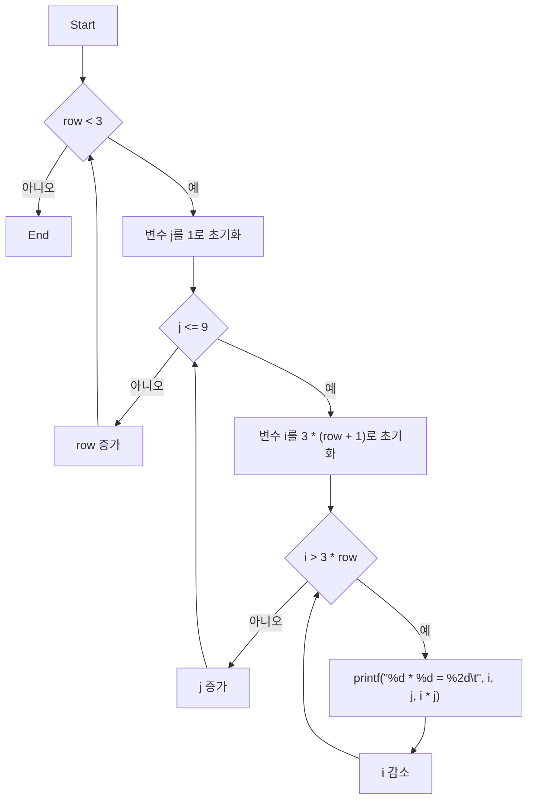

# C 프로그래밍 입문 기말 과제

```c
// 참고용 성적 처리 프로그램
#pragma warning(disable:4996)
#include <stdio.h>	// 표준 입출력을 지원하는 라이브러리
#include <string.h>	// 문자열 연산을 지원하는 라이브러리
#include <stdlib.h>	// 화면을 지우기 위한 system 명령을 지원하는 라이브러리
#include <windows.h>	// 화면에 좌표를 지정하는 gotoxy 용 명령을 지원하는 라이브러리
#include <conio.h>	// 키보드 입력용 getch 를 지원하는 라이브러리

void gotoxy(int x, int y) {
	COORD Pos = { x - 1, y - 1 };
	SetConsoleCursorPosition(GetStdHandle(STD_OUTPUT_HANDLE), Pos);
}
int  InputData();	int  ViewData();	int  EditData();
int  SaveReport0();	int  SaveReport1();	int  SaveReport2();
int  SaveCSV();	int  SaveHTML();

FILE* fp1, * fp2;
char fname1[20], fname2[20], sid[10], name[10];
int N, CNT = 0, score1, score2, score3, total, average;


int main(void) {
	while (1) {
		gotoxy(2, 2);
		printf("\n\t 유수봉의 성적처리 시스템 ");
		printf("\n\t ========================= ");
		printf("\n\t << 작업 목록 >>-------------------------------- ");
		printf("\n\t   1. 새로운 성적 데이터 입력받아 파일에 저장하기 ");
		printf("\n\t   2. 파일에 저장된 성적 데이터 화면에 표시하기 ");
		printf("\n\t   3. 파일에 저장된 성적 데이터를 이용한 성적 집계표 파일 만들기 ");
		printf("\n\t   4. 성적집계표-1 출력 ");
		printf("\n\t   5. 성적집계표-2 출력 ");
		printf("\n\t   6. 개인별 성적 데이터 관리 ");
		printf("\n\t   8. 성적데이터를 Excel File(CSV) 로 출력 ");
		printf("\n\t   9. 성적데이터를 Web Page(HTML) 로 출력 ");
		printf("\n\t   0. 작업끝 ");
		printf("\n\t ------------------------<< 번호를 선택하시오 >>");
		N = getch();

		switch (N) {
		case  '0':  return 0;		break; 	// 작업 종료
		case  '1':  InputData();	break; 	// 데이터 입력
		case  '2':  ViewData();	break; 	// 데이터 확인
		case  '3':  SaveReport0();	break; 	// 성적집계표 출력
		case  '4':  SaveReport1();	break; 	// 성적집계표-1 출력(이름순)
		case  '5':  SaveReport2();	break; 	// 성적집계표-2 출력(성적순)
		case  '6':  EditData();		break; 	// 개인별 데이터 수정
		case  '8':  SaveCSV();		break; 	// Excel File(CSV) 로 출력(이름순) 
		case  '9':  SaveHTML(); 	break; 	// Web Page(HTML) 로 출력(성적순)
		}
		printf("\n\t -------------------------------------<< 확인 >>");
		N = getch();
		system("cls");
	}
}
// 성적 데이터 입력 처리
int  InputData() {

	printf("\n\t 본 작업을 수행하면 기존 데이터를 모두 삭제됩니다.");
	printf("\n\t 그래도 작업을 계속 하시겠습니까? (Y/N) ->");
	N = getch();
	if ((N == 'Y') || (N == 'y')) {
		strcpy(fname1, "c:/Temp/성적데이터.txt");
		// 성적파일을 쓰기 모드로 연다.
		if ((fp1 = fopen(fname1, "w")) == NULL)
		{
			fprintf(stderr, "\n(!) \"%s\" 을 열 수 없습니다.\n", fname1);	return 0;
		}
		else
		{
			printf("\n(!) 새로운 성적 파일 \"%s\"을 만들었습니다.\n", fname1);
		}

		// 사용자로부터 학번, 이름, 성적을 입력받아서 파일에 저장한다.

		CNT = 0;
		while (1) {
			system("cls");
			gotoxy(2, 5);
			printf("-. 학번 :                  ('.' 입력하면 입력을 종료합니다.) : ");
			while (1) {

				gotoxy(12, 5);
				scanf("%s", &sid);
				if (strlen(sid) > 0) break;
			}
			if (strcmp(sid, ".") == 0) { break; }    // 학번이 '.' 인지 확인I 

			gotoxy(2, 6);	printf("-. 이름 : ");	scanf("%s", name);
			gotoxy(2, 8);	printf("-. 국어 : ");	scanf("%d", &score1);
			gotoxy(2, 9);	printf("-. 영어 : ");	scanf("%d", &score2);
			gotoxy(2, 10);	printf("-. 수학 : ");	scanf("%d", &score3);

			fprintf(fp1, "%10s %5s %3d %3d %3d\n",
				sid, name, score1, score2, score3);    // 파일에 저장하기  
			CNT++;
			fflush(stdin);
			printf("\n(!) 총 %d 건의 데이터를 저장하였습니다.(',' 입력끝)", CNT);
			N = _getch();
			if (N == '.') break;
			CNT++;
		}
		printf("\n(!) 총 %d 건의 데이터를 저장하였습니다.", CNT);
		fclose(fp1);

		printf("\n(!) 파일을 닫았습니다.");
	}
	return 0;
}


// 파일에 있는 성적 데이터를 화면으로 출력 처리
int ViewData() {

	strcpy(fname1, "c:/Temp/성적데이터.txt");

	// 성적파일을 읽기 모드로 연다.
	if ((fp1 = fopen(fname1, "r")) == NULL)
	{
		fprintf(stderr, "\n(!) \"%s\" 을 열 수 없습니다.", fname1);  	return 0;
	}
	else
	{
		printf("\n(!) \"%s\" 을 열었습니다.", fname1);
	}

	printf("\n(!) %s 파일 내용은 다음과 같습니다.", fname1);

	printf("\n\t 성적데이터 파일 내용 확인");
	printf("\n\t ========= ====== ==== ==== ==== ");


	while (!feof(fp1)) {
		fscanf(fp1, "%s %s %d %d %d", &sid, name, &score1, &score2, &score3);

		if (feof(fp1)) { break; }

		printf("\n\t %s %s%4d %4d %4d", sid, name, score1, score2, score3);
	}

	printf("\n\t ========= ====== ==== ==== ==== ");

	fclose(fp1);
	printf("\n(!) 파일을 닫았습니다.");

	return 0;
}


char Grade(int X) {
	char grade;
	if (X >= 90) grade = 'A';
	else 	if (X >= 80) grade = 'B';
	else 	if (X >= 70) grade = 'C';
	else 	if (X >= 60) grade = 'D';
	else 	if (X <= 59) grade = 'F';
	return grade;
}

int  EditData() {
	return 0;
}

int  SaveReport1() {
	return 0;
}


int  SaveReport2() {
	return 0;
}
// 파일에 있는 성적 데이터를 합계 평균 처리 후 파일로 출력
int  SaveReport0() {

	// 성적데이터.txt 파일을 읽기 모드로 연다
	strcpy(fname1, "c:/Temp/성적데이터.txt");
	if ((fp1 = fopen(fname1, "r")) == NULL)
	{
		fprintf(stderr, "(!) 입력파일I : \"%s\" 을 열 수 없습니다.\n", fname1);	return 0;
	}
	else
	{
		printf("\n(!) 입력파일 : \"%s\" 을 열었습니다.", fname1);
	}

	// 성적집계표-1.txt 파일을 쓰기 모드로 연다
	strcpy(fname2, "c:/Temp/성적집계표-1.txt");
	if ((fp2 = fopen(fname2, "w")) == NULL)
	{
		fprintf(stderr, "(!) 출력파일 : \"%s\" 을 만들 수 없습니다.\n", fname2); return 0;
	}
	else
	{
		printf("\n(!) 출력파일 : \"%s\" 을 만들었습니다.", fname2);
	}

	// 성적집계표 출력
	fprintf(fp2, "\n\t 성적집계표-1");
	fprintf(fp2, "\n ========= ====== ==== ==== ==== ==== ==== ====");
	fprintf(fp2, "\n 학     번 이  름 국어 영어 수학 합계 평균 등급");
	fprintf(fp2, "\n ========= ====== ==== ==== ==== ==== ==== ====");

	CNT = 0;
	while (!feof(fp1)) {
		fscanf(fp1, "%s %s %d %d %d", sid, name, &score1, &score2, &score3);
		if (feof(fp1)) { break; }

		total = score1 + score2 + score3;	average = total / 3;

		fprintf(fp2, "\n %s %s%4d %4d %4d %5d %4d   %c",
			sid, name, score1, score2, score3, total, average, Grade(average));
		CNT++;
	}
	printf("\n\t(!) 총 %d 건의 데이터를 처리하였습니다. \n", CNT);
	fprintf(fp2, "\n ========= ====== ==== ==== ==== ==== ==== ====\n ");

	// 입/출력 파일 닫기	
	fclose(fp2);	printf("\n(!) 출력파일을 닫았습니다.");
	fclose(fp1);	printf("\n(!) 입력파일을 닫았습니다.");
	system("c:/Temp/성적집계표-1.txt");
	return 0;
}
// 파일에 있는 성적 데이터를 Excel 파일로 출력
int  SaveCSV() {

	// 입력 파일 열기----------------------------------------------------	
	strcpy(fname1, "c:/Temp/성적데이터.TXT");

	if ((fp1 = fopen(fname1, "r")) == NULL)
	{
		printf("\n(!) 입력파일 : \"%s\" 을 열 수 없습니다.", fname1);	return 0;
	}
	else
	{
		printf("\n(!) 입력파일 : \"%s\" 을 열었습니다.", fname1);
	}

	// 출력 파일 열기----------------------------------------------------	
	strcpy(fname2, "c:/Temp/성적집계표.CSV");
	if ((fp2 = fopen(fname2, "w")) == NULL)
	{
		printf("\n(!) 출력파일 : \"%s\" 을 만들 수 없습니다.", fname2);	return 0;
	}
	else
	{
		printf("\n(!) 출력파일 : \"%s\" 을 만들었습니다.", fname2);
	}

	// 성적집계표 (그대로, CSV) 출력----------------------------------------
	fprintf(fp2, "유수봉의 성적표 만들기(CSV) \n");
	fprintf(fp2, "==========,=====,=====,=====,=====,=====,=====,===== \n");
	fprintf(fp2, "학번,이름,국어,영어,수학,합계,평균,등급 \n");
	fprintf(fp2, "==========,=====,=====,=====,=====,=====,=====,===== \n");

	CNT = 0;
	while (!feof(fp1)) {
		fscanf(fp1, "%s %s %d %d %d", sid, name, &score1, &score2, &score3);
		if (feof(fp1)) { break; }

		total = score1 + score2 + score3;
		average = total / 3;

		fprintf(fp2, "%s, %s, %d, %d, %d, %d, %d, %c \n",
			sid, name, score1, score2, score3, total, average, Grade(average));
		CNT++;
	}
	printf("\n\t(!) 총 %d 건의 데이터를 처리하였습니다. \n", CNT);

	fprintf(fp2, "==========,=====,=====,=====,=====,=====,=====,===== \n");

	// 입출력 파일 닫기----------------------------------------------------
	fclose(fp1);	printf("\n(!) 입력파일을 닫았습니다.");
	fclose(fp2);	printf("\n(!) 출력파일을 닫았습니다.");
	system("c:/Temp/성적집계표.CSV");

	return 0;
}
// 파일에 있는 성적 데이터를 HTML 파일로 출력
int  SaveHTML() {

	// 입력 파일 열기
	strcpy(fname1, "c:/Temp/성적데이터.txt");

	if ((fp1 = fopen(fname1, "r")) == NULL) {
		fprintf(stderr, "(!) 입력파일 : \"%s\" 을 열 수 없습니다.\n", fname1);	return 0;
	}
	else {
		printf("(!) 입력파일 : \"%s\" 을 열었습니다.\n", fname1);
	}

	// 출력 파일 열기	
	strcpy(fname2, "c:/Temp/성적집계표.HTML");
	if ((fp2 = fopen(fname2, "w")) == NULL) {
		fprintf(stderr, "(!) 출력파일 : \"%s\" 을 만들 수 없습니다.\n", fname2); return 0;
	}
	else {
		printf("(!) 출력파일 : \"%s\" 을 만들었습니다.\n", fname2);
	}

	// 성적집계표-1 (그대로, HTML) 출력----------------------------------------
	fprintf(fp2, "<!DOCTYPE html><HTML><HEAD> \n");

	fprintf(fp2, "<TITLE>유수봉의 HTML 성적표</TITLE> \n");
	fprintf(fp2, "<STYLE> \n");
	fprintf(fp2, "table {border-collapse: collapse; text-align: center; width: 500px; } \n");
	fprintf(fp2, "table tr:hover {background-color: lightgreen; height:40px;} \n");
	fprintf(fp2, "</STYLE></HEAD><BODY> \n");
	fprintf(fp2, "<DIV align=center><H2>유수봉의 성적표 만들기(HTML)</H2></DIV> \n");
	fprintf(fp2, "<TABLE border=1 align=center> \n");
	fprintf(fp2, "<THEAD> \n");
	fprintf(fp2, "<TR><TH>학번</TH><TH>이름</TH><TH>국어</TH><TH>영어</TH><TH>수학</TH><TH>합계</TH><TH>평균</TH><TH>등급</TH></TR> \n");
	fprintf(fp2, "</THEAD><TBODY> \n");

	CNT = 0;
	while (!feof(fp1)) {
		fscanf(fp1, "%s %s %d %d %d", sid, name, &score1, &score2, &score3);
		if (feof(fp1)) { break; }
		total = score1 + score2 + score3;	  average = total / 3;

		fprintf(fp2, "<TR><TD>%s</TD><TD>%s</TD><TD>%d</TD><TD>%d</TD><TD>%d</TD><TD>%d</TD><TD>%d</TD><TD>%c</TD></TR> \n",
			sid, name, score1, score2, score3, total, average, Grade(total));
		CNT++;
	}
	printf("\t(!) 총 %d 건의 데이터를 처리하였습니다. \n", CNT);
	fprintf(fp2, "</TBODY> \n");
	fprintf(fp2, "</TABLE> \n");
	fprintf(fp2, "</BODY> \n </HTML> \n");

	// 입/출력 파일 닫기----------------------------------------------------
	fclose(fp1);	printf("(!) 입력파일을 닫았습니다.\n");
	fclose(fp2);	printf("(!) 출력파일을 닫았습니다.\n");
	system("c:/Temp/성적집계표.HTML");
	return 0;
}

```



```c
#include <stdio.h>

int main() {
    for (int row = 0; row < 3; row++) {
        for (int j = 1; j <= 9; j++) {
            for (int i = 3 * (row + 1); i > 3 * row; i--) {
                printf("%d * %d = %2d\t", i, j, i * j);
            }
            printf("\n");
        }
        printf("\n");
    }
    return 0;
}

```



믄자열 현출일


