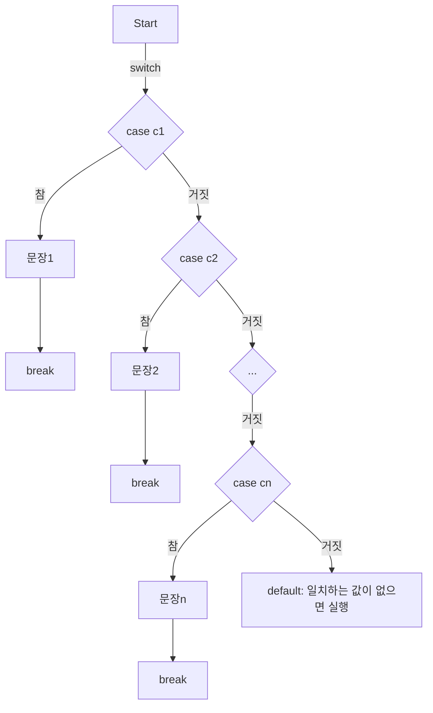

# Switch 문

여러 가지 경우 중에서 하나를 선택하는데 사용

```mermaid
graph TD
    A[Start] -->|switch| B{case c1}
    B -->|참| B1[문장1]
    B1 --> B2[break]
    B -->|거짓| C{case c2}
    C -->|참| C1[문장2]
    C1 --> C2[break]
    C -->|거짓| D{...}
    D -->|거짓| E{case cn}
    E -->|참| E1[문장n]
    E1 --> E2[break]
    E -->|거짓| F[default: 일치하는 값이 없으면 실행]

```
